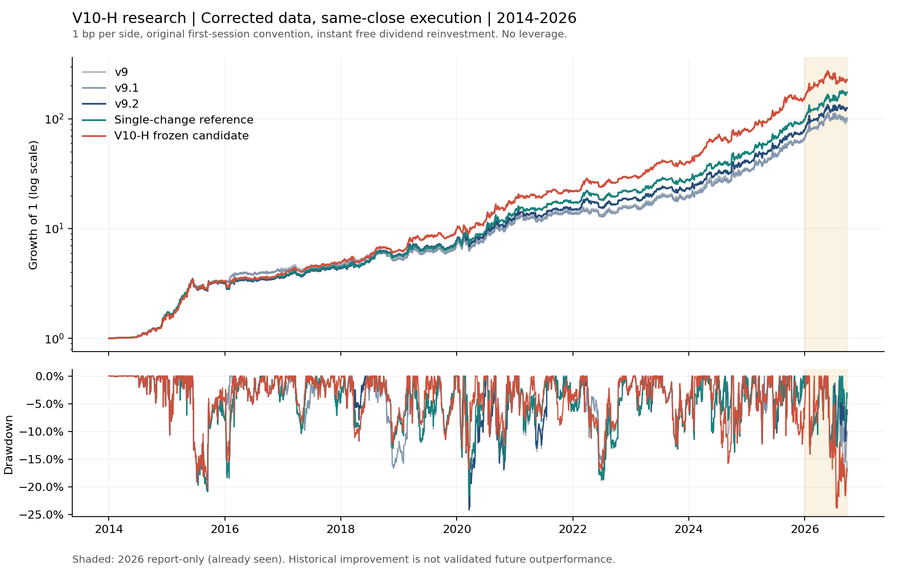

# V10深入迭代报告

**本轮达到历史回测收益目标：新H年化53.31%，高于同数据v9.2的46.32%；不能据此宣称未来稳定超额或已消除过拟合。**

统一期间为2014-01-02—2026-09-24。采用修正后的总回报收盘指数、原同收盘信号/成交、首评日免费、之后每次整仓切换净值乘0.9998，无杠杆。这里比较的不是旧失真复权输入下的50.42%；输入和撮合假设与本轮v9基准完全相同。

## 总体与逐年

| 版本 | 累计收益 | 年化 | 最大回撤 | 换仓次数 |
|---|---|---|---|---|
| v9 | +9,468.84% | +43.24% | -24.16% | 254 |
| v9.1 | +9,960.00% | +43.81% | -24.16% | 249 |
| v9.2 | +12,432.65% | +46.32% | -24.16% | 272 |
| 新V10-H | +22,566.90% | +53.31% | -23.88% | 315 |
| 单项简化对照 | +17,275.44% | +50.13% | -21.68% | 269 |

“单项简化对照”只在v9.2上增加普通排名轮动最短持有2日，保留风险退出例外。它是已有登记配置的解释性对照，未冒称独立验证的新S，也未替换冻结H。主收益冠军与风险门槛选择均为同一H，不是两次独立确认。

| 连续区间 | H年化 | v9.2年化 | H最大回撤 | v9.2最大回撤 |
|---|---|---|---|---|
| 2014–2017 | +48.30% | +43.88% | -20.24% | -20.86% |
| 2018–2021 | +46.26% | +36.88% | -16.76% | -24.16% |
| 2022–2025 | +63.58% | +52.23% | -17.00% | -18.81% |
| 2014–2025（用于选型） | +52.50% | +44.18% | -20.24% | -24.16% |

| 年份 | v9 | v9.1 | v9.2 | 新V10-H | 单项简化对照 |
|---|---|---|---|---|---|
| 2014 | +65.58% | +65.58% | +65.58% | +62.45% | +69.49% |
| 2015 | +90.95% | +90.55% | +90.55% | +102.58% | +90.55% |
| 2016 | +34.62% | +30.33% | +13.21% | +17.33% | +13.21% |
| 2017 | +11.22% | +10.09% | +20.15% | +25.49% | +20.15% |
| 2018 | +17.57% | +17.57% | +35.83% | +31.19% | +30.66% |
| 2019 | +33.34% | +34.22% | +34.22% | +54.36% | +33.30% |
| 2020 | +63.95% | +63.95% | +63.95% | +85.20% | +84.76% |
| 2021 | +16.15% | +17.00% | +17.00% | +21.46% | +22.75% |
| 2022 | +13.32% | +13.32% | +23.93% | +32.91% | +26.58% |
| 2023 | +25.93% | +25.93% | +25.62% | +38.47% | +27.52% |
| 2024 | +71.66% | +74.43% | +74.43% | +93.08% | +74.70% |
| 2025 | +95.08% | +95.65% | +95.41% | +98.66% | +102.63% |
| 2026（截至09-24） | +41.69% | +50.74% | +57.36% | +45.47% | +75.27% |

H在2026这一段累计**45.47%**，低于v9.2的**57.36%**；同期最大回撤**23.88% / 14.69%**。这部分不能省略，也不能把不足一年累计收益称为全年收益。

## H的具体规则

原11只ETF池、单一标的轮动、熊市动量门槛7%、分池缓冲2%/3%/3%、过热门和危机抄底框架保留。改动为：

1. 用20日WLS相对斜率除以20日日收益标准差，取最近3个有效报价日评分平均，代替原WLS25。
2. 沪深300牛熊门由MA250改为MA180。
3. 急跌退出阈值由固定4%改为`clip(1.5 × VOL20, 2%, 10%)`；VOL20是日收益标准差，包含当日收盘。

冻结ID：`vd_7d52c290adc6c4503f7d`。参数包含原有深跌/QVIX/量能通道与5日危机锁仓。未引入杠杆、动态优化权重或按年份切换规则；未接管生产推送或真实持仓。

## 探索过程与样本选择

| 阶段 | 累计唯一单持仓配置 | 2014–2025所选年化 | 同配置全程年化 |
|---|---|---|---|
| mechanisms | 1355 | +47.14% | +49.81% |
| combinations | 6038 | +49.38% | +50.60% |
| refinements | 9558 | +52.50% | +53.31% |

累计9558个唯一单持仓配置：1355初始机制、4683新增双机制组合、3520新增第三阶段组合/简化。各阶段保留前一阶段集合，所以不能把累计数简单相加作为不同试验数。另有36个独立多持仓配置及冻结后的诊断情景，均单独留档。

每阶段先登记、用2014–2025选型并写出选择，再展示全程/2026；后两阶段依据前阶段已知训练表现自适应提出。所有历史此前已经研究，**2026也不是干净样本外**。前三段改善不等于三次独立验证。

风险门槛为：选型年化至少比v9.2高2个百分点、回撤最多多5个百分点、2022–2025最多落后2个百分点、FEE5不低于同费基准。最后695个配置通过，最终H按选型收益最高冻结；不根据后面的压力结果改选。

## 费用、执行时点及数据精度

| 压力情景 | H年化 | v9.2年化 | H最大回撤 | v9.2最大回撤 |
|---|---|---|---|---|
| 原收盘，单边1bp | +53.31% | +46.32% | -23.88% | -24.16% |
| 原收盘，单边5bp | +50.29% | +43.83% | -24.55% | -24.71% |
| 原收盘，单边11bp | +45.88% | +40.17% | -25.54% | -25.52% |
| 原收盘，单边21bp | +38.79% | +34.27% | -27.17% | -26.85% |
| 滞后一日收盘，单边1bp | +38.18% | +30.85% | -35.13% | -38.67% |
| 滞后一日收盘，单边5bp | +35.44% | +28.63% | -36.00% | -40.08% |
| 滞后一日收盘，单边11bp | +31.44% | +25.36% | -37.30% | -42.13% |
| 滞后一日收盘，单边21bp | +25.02% | +20.08% | -40.41% | -45.40% |
| 分红推断下界 | +53.94% | +46.75% | -23.88% | -24.16% |
| 分红推断上界 | +53.31% | +46.32% | -23.88% | -24.16% |
| 515100官方金额替代 | +53.31% | +46.32% | -23.88% | -24.16% |

H在11种情景中均保留相对v9.2的全程收益优势，但绝对收益对执行时间敏感：滞后一日、单边1bp时H年化38.18%、最大回撤35.13%；2026累计变为−6.02%。这是按前日特征和实际持仓重新决策、在当日收盘执行的压力模型，不是固定信号重放，不是次日开盘，也不是14:50实盘验证。

原费用约定忽略首次建仓、固定同价线性扣费。精度情景只改变条件区间内的现金金额，重算信号和持仓，因此分红下界情景的策略收益反而可能更高；它不是组合收益的数学下界。官方515100金额替代对选定5个配置无影响，因为它们未采用该资产。

## 局部敏感性与消融

| 冻结后单项诊断（不重选） | 全程年化 | 最大回撤 |
|---|---|---|
| 冻结H | +53.31% | -23.88% |
| 原v9.2 | +46.32% | -24.16% |
| 评分恢复原WLS25 | +50.44% | -19.97% |
| 均线恢复MA250 | +48.09% | -27.57% |
| 急跌恢复固定4% | +46.34% | -22.30% |
| 仅移除QVIX | +53.36% | -23.88% |
| 只保留深跌抄底 | +49.93% | -26.18% |
| 去掉全部抄底通道 | +44.99% | -24.19% |
| 均线改MA150 | +50.15% | -23.88% |
| 均线改MA200 | +50.28% | -24.98% |
| 波动倍数改1.35 | +53.40% | -20.85% |
| 波动倍数改1.65 | +49.63% | -30.48% |
| WLS20不平滑 | +49.14% | -25.04% |
| WLS20取2日评分均值 | +50.92% | -23.68% |
| WLS20取4日评分均值 | +49.48% | -23.88% |
| WLS18取3日评分均值 | +48.58% | -23.48% |
| WLS22取3日评分均值 | +48.87% | -24.28% |

邻近窗口/均线大多仍高于v9.2，但并非完全平坦的平台。波动倍数从1.5提高10%到1.65，年化降到49.63%、最大回撤升到30.48%，说明参数选择仍明显影响风险。恢复固定4%急跌门后几乎回到基准收益；各项贡献有交互，不能相加。

去掉QVIX得到53.36%只是事后简化诊断，未用这0.05个百分点回流替换已冻结ID。改成更简单的WLS25得到50.44%、回撤19.97%，同样只作对照。完整注册和结果见[neighborhood](results/refinements/neighborhood/evaluation.json)。

## 过拟合：改善成立，但泛化证据不足

- 全9558族在2919个选型交易日上的White-style区块检验：20日p=0.9690，60日p=0.9610（各1000次）。没有显示搜索后显著超额。该方法可能保守，条件于已经自适应构造的候选族；不是SPA/PBO，也不是未来失败或过拟合概率。
- 四段历史重选仅一段胜出。已知候选族的拼接收益年化+34.03%，基准+44.34%；族本身用过未来历史，且拼接未建模切换持仓成本，不能当可交易OOS。
- 最大10个优势日解释净对数超额的91.63%；优势有明显集中性。删除这些日期只是固定路径归因，不是可执行替代策略。
- 固定路径排除2014–2015后，H年化48.58%，基准41.12%，表明提升并非完全由最早两年驱动，但这仍不能取代未来检验。

完整统计、逐日贡献和限制见[diagnostics](results/refinements/diagnostics.md)。结论是值得保存并作独立前向观察的研究候选；不把53.31%当作未来承诺。

## S与多持仓尝试

额外登记36个无抄底top1/2/3配置，用真实份额、成员变化再平衡和全部权重换手计费。多持仓S的门槛没有放松：24个top2/3候选均未达到训练年化30%和近期年化25%，故`S=None`。
最佳top2全程年化29.75%、回撤26.04%，也不能四舍五入包装成30%达标。该族和原有S策略不是同一个东西，本轮没有替换此前S。见[组合研究报告](results/portfolios/REPORT.md)。

## 实现与复现

3个旧控制的3097日原路径逐值保真；28个预定真实配置与独立Python实现逐值一致；最终H与v9.2在0/1/5bp下再做6次独立全程复算，持仓和收益最大误差0。所有单持仓候选的FEE5由完整新运行复核，训练前缀加入2026后不变。组合72条路径另行重建审计。

原数据仍有条件性分红推断、除息日立即免费再投资、幸存ETF池、上市预热和缺报价等限制，详见[数据审查](DATA_REVIEW.md)。实盘付款时差、整手、溢价/冲击和14:50可得性未完整模拟。

运行入口及冻结配置见[README](README.md)与[profiles](profiles.json)。新研究仅写本目录，535个旧文件哈希保持不变。各阶段源码/输入/注册/选择/矩阵哈希保留；完整矩阵无损归档后可按归档工具恢复。
