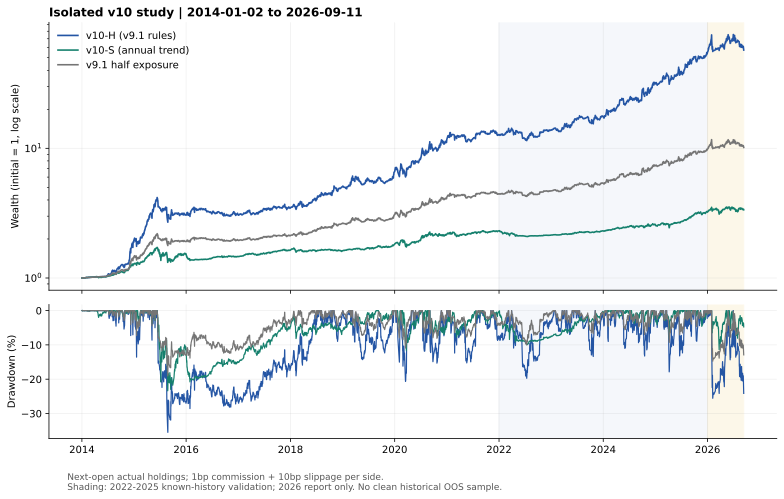

# v10 两条路线：完整研究结果

固定样本：2014-01-02 至 2026-09-11。单边佣金 0.01% + 滑点 0.10%，昨收盘信号次开盘成交；实际单位数和现金记账，延期成交后根据实际持仓继续决策。

**本轮没有发现符合预定标准的高收益信号改进。v10-H 保留 v9.1 信号逻辑，交付为独立冻结实现，不宣称增加了收益来源。v10-S 减少了规则和换手，但其历史风险收益没有优于半仓 v9.1；不建议仅凭“稳健”名称替换现有策略。**

## 所选版本与仓位对照

| 版本 | 净年化 | 最大回撤 | 年化波动 | 平均非货币ETF占比 | 年均调仓日 | 双向年均金额换手 |
|---|---:|---:|---:|---:|---:|---:|
| v10-H | 37.69% | -35.49% | 26.81% | 96.28% | 21.18 | 42.23倍 |
| v10-S | 10.04% | -23.38% | 10.69% | 72.05% | 11.93 | 2.00倍 |
| v9.1半仓对照 | 20.11% | -19.04% | 13.79% | 49.00% | 21.18 | 21.46倍 |

v10-S 的非货币仓位包括国债ETF，不能把它与全权益风险直接等同。半仓对照在风险资产切换时重新分配50%/50%，持有期间允许比例漂移；其结果仅为仓位压缩参照，不能据此证明原策略没有选型偏差。

## 选择顺序与分段

先保存注册文件，再仅运行2014–2021，保存两个选择ID，最后运行后段与成本/邻域。所有区间都已在项目历史研究中见过，下面的validation不是真正未见样本外。

| 版本 | 2014–2021开发年化 | 2022–2025已见验证年化 | 2026截至09-11累计收益 |
|---|---:|---:|---:|
| v10-H | 37.55% | 44.46% | +3.99% |
| v10-S | 11.06% | 8.71% | +4.22% |
| v9.1半仓对照 | 20.58% | 22.09% | +3.15% |

所选高收益ID：`control_v91`；所选稳健ID：`r_m12_broad`。验证后未换赢家。原始登记和选择时间分别见 `registration.json`、`selection.json`。

## 全部10项结果（含失败项）

| ID | 开发年化 | 开发回撤 | 全程年化 | 全程回撤 | 2022–2025年化 |
|---|---:|---:|---:|---:|---:|
| control_v91 | 37.55% | -35.49% | 37.69% | -35.49% | 44.46% |
| control_v9 | 38.02% | -35.49% | 36.80% | -35.49% | 42.64% |
| control_v91_half | 20.58% | -19.04% | 20.11% | -19.04% | 22.09% |
| h_no_crash | 32.77% | -41.09% | 31.95% | -41.09% | 35.84% |
| h_no_bear_gate | 35.43% | -35.49% | 36.60% | -35.49% | 44.65% |
| h_ensemble | 36.66% | -35.49% | 36.22% | -35.49% | 42.29% |
| h_core_pool | 35.66% | -35.49% | 35.37% | -35.49% | 37.67% |
| r_m12_top2 | 13.91% | -50.69% | 14.17% | -50.69% | 14.35% |
| r_multi_top2 | 9.64% | -54.57% | 9.99% | -54.57% | 10.67% |
| r_m12_broad | 11.06% | -23.38% | 10.04% | -23.38% | 8.71% |

两个Top2长周期候选的开发期回撤超过50%，未通过预定稳健门槛。长周期、少参数本身不保证低风险；固定五份额的分散是所选稳健版本的重要结构差异。

## 逐年收益

| 年份 | v10-H | v10-S | v9.1半仓对照 |
|---|---:|---:|---:|
| 2014 | +95.03% | +28.39% | +45.43% |
| 2015 | +56.28% | +19.45% | +31.34% |
| 2016 | +0.84% | -4.38% | +2.31% |
| 2017 | +12.37% | +11.65% | +8.38% |
| 2018 | +45.99% | -0.92% | +24.25% |
| 2019 | +30.74% | +12.15% | +16.64% |
| 2020 | +77.43% | +19.85% | +36.76% |
| 2021 | +9.26% | +6.04% | +6.28% |
| 2022 | +8.53% | -7.26% | +5.47% |
| 2023 | +27.52% | +7.70% | +14.74% |
| 2024 | +77.51% | +11.15% | +35.84% |
| 2025 | +75.42% | +25.52% | +34.37% |
| 2026截至09-11 | +3.99% | +4.22% | +3.15% |

各年度沿用同一条持仓路径，年度收益复利连乘等于全程净值，不是每年重新从现金开始。

## 成本敏感性

下表只改变单边滑点，佣金始终为单边1bp；1bp=0.01%。

| 版本 | 5bp滑点年化 | 10bp主情景 | 20bp滑点年化 | 50bp滑点年化 |
|---|---:|---:|---:|---:|
| v10-H | 40.63% | 37.69% | 31.99% | 16.27% |
| v10-S | 10.15% | 10.04% | 9.82% | 9.16% |
| v9.1半仓对照 | 21.41% | 20.11% | 17.56% | 10.23% |

## 预定窗口邻域（只诊断，不重新选型）

| 路线 | 窗口倍率 | 实际窗口 | 全程年化 | 最大回撤 |
|---|---:|---|---:|---:|
| high_return | 0.9 | [22] | 35.56% | -33.62% |
| high_return | 1.1 | [28] | 36.84% | -30.21% |
| robust | 0.9 | [220] | 9.32% | -24.46% |
| robust | 1.1 | [268] | 10.34% | -24.33% |

## 收益归因与覆盖

每个资产的收盘单位数、隔夜与日内损益，以及佣金/滑点均按实际成交重建。各资产贡献转换为可加的对数增长，合计严格等于全程log净值；这是归因，不是删除该资产后的可交易回测。

| 版本 | 最佳10日置零后的账面年化 | 最佳10日占净对数增长 | 延期调仓次数 |
|---|---:|---:|---:|
| v10-H | 29.28% | 19.69% | 1 |
| v10-S | 7.25% | 26.82% | 0 |
| v9.1半仓对照 | 16.23% | 17.91% | 1 |

| ETF | 快照首日 | 首次可计算244观察期收益 | 首次满足旧规则270根预热 |
|---|---|---|---|
| 159915 | 2011-12-09 | 2012-12-11 | 2013-01-18 |
| 588080 | 2020-11-16 | 2021-11-17 | 2021-12-22 |
| 510300 | 2012-05-28 | 2013-05-30 | 2013-07-09 |
| 510500 | 2013-03-15 | 2014-03-21 | 2014-04-28 |
| 563300 | 2023-09-14 | 2024-09-19 | 2024-10-31 |
| 512400 | 2017-09-01 | 2018-08-31 | 2018-10-15 |
| 512890 | 2019-01-18 | 2020-01-20 | 2020-03-03 |
| 513100 | 2013-05-15 | 2014-05-19 | 2014-06-24 |
| 513120 | 2022-07-12 | 2023-07-13 | 2023-08-17 |
| 518880 | 2013-07-29 | 2014-07-29 | 2014-09-02 |
| 511880 | 2013-07-12 | 2014-07-14 | 2014-08-18 |
| 511010 | 2013-03-25 | 2014-03-31 | 2014-05-08 |

各次月度信号的可用/不可用资产名单保存在 `paths.json` 的 policy_metadata.rebalance_events；早期未成熟资产的份额留货币，不回填预上市历史。

## 与旧回测数字的区别

本轮截至09-11，此前v9报告截至09-24；且本轮根据实际成交持仓重新决策，原报告为固定收盘目标路径重放。510500在2015-04-13、04-14缺行，新执行器保留待成交订单并于04-15开盘成交，导致两条路径在4个日期不同。佣金也严格按实际成交金额扣除。不能把本轮37.69%与旧报告37.13%的差解释成新规则增加了收益。

冻结策略源码与原策略逻辑AST一致，同状态下独立指标与决策相同；2016–2021两个对照各1461日目标一致。2014–2021的4日执行差异保留在 `legacy_fidelity.json`，没有强行抹平。

## 适用边界

- 参数更少、月度调仓、现金回退限制本轮研究自由度，但不保证未来盈利或固定最大回撤。
- 资产池仍来自事后可获得的ETF集合，并非完整历史存续基金数据库；复权数据也可能修订。
- 尚未模拟盘口、真实限价可成交性、涨跌停封单、资金规模冲击、整手约束和实际申赎/溢价约束。
- 月度信号不意味着月内有止损，趋势反转时仍会承受亏损。v10-S在2016、2018、2022年亏损。
- 暂不接入现有每日推送或实盘账本，下一步应冻结规则并积累独立未来数据及可核查实际成交。

本轮7个新候选、3个控制，30个额外成本情景、4个窗口诊断；全部结果保留，不把本轮预算冒称全项目独立试验数。

