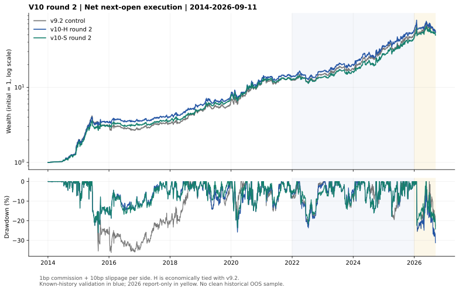

# 第二轮：H超越v9.2、S年化至少30%的研究结果

**S 找到了达到历史净年化30%门槛、回撤较低的候选。H仅数值上高出v9.2约0.001535个百分点，经济上几乎持平，没有足够证据宣称收益升级。**

固定区间2014-01-02至2026-09-11；主口径为收盘决策、次日开盘实际成交，单边佣金0.01%＋滑点0.10%。所有策略使用同一份价格、同一执行引擎和费用；本轮不更新或改动此前版本。

## 公平对照

| 版本 | 次开盘成本后年化 | 最大回撤 | 2022–2025净年化 | 2026截至09-11累计收益 | 理想同收盘年化 |
|---|---:|---:|---:|---:|---:|
| v9.1对照 | 37.69046% | -35.49% | 44.46% | +3.99% | 48.46% |
| v9.2对照 | 37.02704% | -36.27% | 42.20% | +5.92% | 50.01% |
| v10-H第二轮 | 37.02857% | -31.26% | 42.52% | -6.40% | 48.41% |
| v10-S第二轮 | 36.10763% | -26.04% | 37.61% | +7.89% | 45.89% |

理想同收盘单边佣金仍为0.01%、滑点为0，是读取完整收盘信息后按该收盘价成交的反事实诊断；不用于本轮选型，不能与次开盘结果混为一谈。**H在理想收盘口径没有超过v9.2**；若用户要求两种口径都超过，本轮H不满足。

## 冻结的两条路线

- H：`h_qvix_score25_30`。保留原深跌和QVIX通道，删除量能通道，使用固定WLS25/30分数均值。少一个事件通道不等于已经证明更少过拟合；QVIX日期与发布时间仍有限制。
- S：`s_v91_wls30`。v9.1底座只把WLS25改为WLS30，其余规则和池不变，保留原深跌抄底；这是参数稳健候选，**没有减少全部规则数量或消除危机事件依赖**。

选择在2014–2021计算后即写入selection.json；2022–2025和2026结果随后揭示。主验收和强化检查的布尔值保留原协议定义，没有事后新增1pp门槛或更换冠军；不过数值上严格大于，并不自动等于有经济意义或统计支持。

## 所有9项（含未选中候选）

| ID | 开发期年化 | 开发期回撤 | 全程年化 | 全程回撤 | 2022–2025年化 |
|---|---:|---:|---:|---:|---:|
| c_v91 | 37.55% | -35.49% | 37.69% | -35.49% | 44.46% |
| c_v92 | 37.26% | -36.27% | 37.03% | -36.27% | 42.20% |
| h_qvix_only | 37.55% | -35.49% | 38.66% | -35.49% | 47.72% |
| h_v91_no_overheat | 37.55% | -35.49% | 37.94% | -35.49% | 45.29% |
| h_qvix_score25_30 | 39.25% | -26.04% | 37.03% | -31.26% | 42.52% |
| s_v91_wls30 | 37.72% | -26.04% | 36.11% | -26.04% | 37.61% |
| s_v91_wls30_no_crash | 33.39% | -30.84% | 30.71% | -30.84% | 29.40% |
| s_accounts25_30 | 37.63% | -31.11% | 36.93% | -31.11% | 41.14% |
| s_accounts20_25_30 | 37.28% | -32.42% | 36.13% | -32.42% | 40.59% |

例如`h_qvix_only`全程收益高于本轮冻结的H，但它不是开发期按协议选出的版本，不能看完后段后换它当‘通过验证的赢家’。它保留为已知历史上的备选假设，未获得新的独立验证。

## 成本与窗口敏感性

| 版本 | 单边10bp滑点 | 20bp滑点 | 50bp滑点 |
|---|---:|---:|---:|
| v9.1对照 | 37.69% | 31.99% | 16.27% |
| v9.2对照 | 37.03% | 30.88% | 14.04% |
| v10-H第二轮 | 37.03% | 31.34% | 15.64% |
| v10-S第二轮 | 36.11% | 30.56% | 15.22% |

滑点之外均再计单边1bp佣金；30%是主情景历史目标，不是任何成本下都成立。

| 路线 | 全部同族窗口倍率 | 全程年化 | 最大回撤 |
|---|---:|---:|---:|
| high_return | 0.9 | 38.46% | -35.49% |
| high_return | 1.1 | 35.80% | -26.04% |
| robust | 0.9 | 35.75% | -31.26% |
| robust | 1.1 | 35.79% | -26.00% |

邻域仅诊断，不把较好的邻居重新发布成赢家。WLS30此前已经被研究过，本轮重新比较不能称全新发现。

## H的增量不确定性

按同步日期、循环连续区块，配对重采样10,000次；以下为H减v9.2的年化收益差区间（百分点）：

| 区块长度 | 实际差 | 条件95%区间 |
|---|---:|---:|
| 20日 | +0.001535 | [-6.19, +6.26] |
| 60日 | +0.001535 | [-6.24, +6.39] |
| 120日 | +0.001535 | [-6.08, +6.32] |

区间全部跨零，而且没有校正历次选型偏差；不能解释为PBO、未来收益概率或严格的样本外显著性。2026仅报告期内H亏损，也没有触发事后补规则。

## 逐年收益（主成本口径）

| 年份 | v9.2 | v10-H第二轮 | v10-S第二轮 |
|---|---:|---:|---:|
| 2014 | +95.03% | +93.04% | +81.02% |
| 2015 | +56.28% | +74.50% | +65.49% |
| 2016 | -10.05% | +5.44% | +5.08% |
| 2017 | +19.32% | +12.37% | +12.10% |
| 2018 | +51.56% | +47.74% | +44.51% |
| 2019 | +30.74% | +35.58% | +46.78% |
| 2020 | +77.43% | +58.09% | +56.69% |
| 2021 | +9.26% | +11.54% | +10.04% |
| 2022 | +18.33% | +15.93% | +5.84% |
| 2023 | +19.01% | +23.11% | +18.89% |
| 2024 | +82.91% | +73.90% | +68.77% |
| 2025 | +57.14% | +64.54% | +67.34% |
| 2026截至09-11 | +5.92% | -6.40% | +7.89% |

## 数据、计时和证据边界

- 原策略、第一轮v10及行情/账本共177个保护文件哈希未变；第二轮只新增本目录。
- 价格沿用第一轮截止09-11快照。QVIX截至该日最后可用行是09-09，09-10与09-11按严格当日规则停用QVIX通道，不前填。历史实际发布时间仍无法核实；next-open只能假设前日值此前已公开。
- 同收盘诊断使用同一单位数/费用求解器，并将五个完整持有收益区间对应到收盘入场时钟；不是多持有一天来增加收益。无缺行短窗的目标与旧lab已核对。
- 独立账户组合初始均分，此后财富占比漂移；没有账户间补仓、周期重置、杠杆或相反交易免佣。逐账户状态、份额和待成交指令均保留。
- 原ETF池、短周期规则和稀有抄底事件仍有历史选择偏差；全部区间均已被研究过，不能称干净样本外。
- 日线模拟未解决盘口、涨跌停封单、资金冲击、整手交易、复权修订和QDII溢价成交等问题。

本轮登记2个对照、7个候选；另外18个成本情景、9个同收盘诊断、4个邻域，没有按结果追加候选。完整路径及精确资产/成本归因保存在paths.json/evaluation.json。

方法背景：[回测过拟合概率](https://www.davidhbailey.com/dhbpapers/backtest-prob.pdf)、[Deflated Sharpe Ratio](https://www.davidhbailey.com/dhbpapers/deflated-sharpe.pdf)；不能用重复挑选出来的高收益直接推断未来可靠性。

