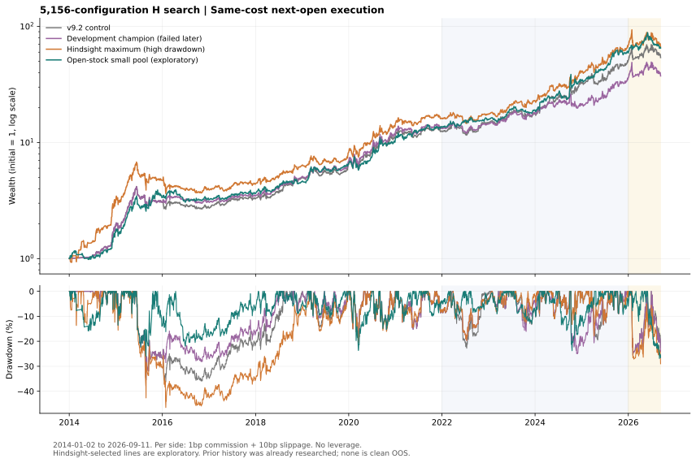

# v10-H大规模搜索：5,156配置及去牛熊消融

**找到了更高的历史回测，但没有找到能够据此宣布可靠升级的强H。** 全历史最高净年化39.31%伴随46.52%最大回撤；另一小池、WLS30、熊市开放A股的探索候选为39.08%/−26.88%。开发期预先选中的版本在后段失败，不能用后来更好看的候选替换它后声称验证成功。

固定共同区间2014-01-02至2026-09-11。主口径：收盘信号、次日开盘实际持仓反馈、单边佣金0.01%＋滑点0.10%，初始和全部实际买卖收费，无杠杆。全部历史均已被项目研究过，不是干净样本外。

## 核心比较

| 配置 | 全程净年化 | 最大回撤 | 2022–2025年化 | 2026截至09-11累计 | 理想同收盘年化 |
|---|---:|---:|---:|---:|---:|
| v9.2对照 | 37.03% | -36.27% | 42.20% | +5.92% | 50.01% |
| 开发期冻结选择 | 33.13% | -35.49% | 28.36% | +3.99% | 45.00% |
| 全历史回看最高 | 39.31% | -46.52% | 43.82% | -3.32% | 53.21% |
| 熊市开放A股探索候选 | 39.08% | -26.88% | 44.46% | +10.08% | 43.31% |

理想同收盘是完整收盘数据生成信号后仍按同一收盘价成交的反事实诊断，含1bp佣金、无滑点；不可把它与主口径混淆，也不等同14:50实盘。

## 枚举范围与选择记录

原始5,164项，语义去重后5,156项；所有候选先开发期、再全程复算，共10,312条主候选回测，另有控制与诊断。没有只保留赢家。
开发期按2014–2017、2018–2021及全开发区间三项净年化均超过v9.2筛选，再按开发净CAGR固定排序。只有2项合格，且开发期持仓/收益路径完全相同：差别只是是否保留2023年才有效的513120，不能把它们当两份独立确认。冠军由预定ID字典序决定。

开发冻结者为v9.1底座增加房地产ETF512200。开发年化38.30%，但2022–2025只有28.36%，低于同期v9.2的42.20%。这项失败完整保留。其开发前半段对v9.2的优势来自已有v9.1规则差异，不能全归功于新增房地产ETF。

本轮5,156配置对应1690条开发期不同收益路径、4760条全程不同路径；配置数不是独立假设数。

| 家族 | 全程最高净年化 | 对应最大回撤 |
|---|---:|---:|
| pool_subsets | 38.25% | -26.04% |
| rule_grid | 38.00% | -35.49% |
| extra_stock_single | 39.24% | -46.52% |
| extra_global_single | 37.57% | -26.04% |
| fixed_baskets | 39.31% | -46.52% |
| ranking_ablation | 37.54% | -31.96% |
| regime_ablation | 39.08% | -26.88% |

各家族最高者都是回看挑选，表格只是搜索全景，不是七次独立验证。

## 用户提出的牛熊门问题：保持其他参数不变

以下以原v9.1池、WLS25及其他参数为锚，比较已经登记的配对配置：

| 唯一体制开关变化 | 净年化 | 最大回撤 |
|---|---:|---:|
| 原MA250体制 | 37.69% | -35.49% |
| 启用原bear_open_stock开关 | 33.14% | -35.49% |
| 取消体制，固定原牛市路径 | 32.94% | -35.49% |
| 取消体制，股票/跨境/黄金统一竞赛 | 28.77% | -40.27% |

这里直接去门控没有改善原v9.1。39.08%的探索候选还同时缩小了池、把WLS25改为30，因此不能说‘只去掉牛熊门就把37.69%提升到39.08%’。

`open_stock`沿用旧开关的完整语义：沪深300体制仍用于熊市7%门槛；股票与免体制门资产竞赛，黄金转为备胎/兜底，不再作为原熊市常规竞赛成员。它既不是完全不看体制，也不是保持黄金角色不变的纯A股放行。`always_bull`取消的是沪深300MA250体制判断；开启抄底时仍使用各资产自身年线距离。

在所有能够找到已登记、完全同参数MA250对照的配置中：

| 模式 | 已匹配对照数 | 全程收益提高数 | 配对年化差中位数 |
|---|---:|---:|---:|
| open_stock | 56 | 28 | -0.61个百分点 |
| always_bull | 56 | 17 | -0.72个百分点 |
| all_assets | 56 | 0 | -6.93个百分点 |

每种模式其余40项缺少完全一致的已登记对照，没有事后补造它们以扩大样本。这些配对也相关、也已见历史，不能作为独立因果试验。

## 三个交付配置的完整规则

### 开发期冻结选择：`search_71a83b0ffb03d6d62cc9`

- A股池：创业板ETF(159915)、沪深300ETF(510300)、中证500ETF(510500)、房地产ETF(512200)、有色金属ETF(512400)、红利低波ETF(512890)、中证2000ETF(563300)、科创50ETF(588080)
- 免A股体制门的资产：纳指ETF(513100)、港股创新药ETF(513120)
- 黄金518880、货币511880；满仓单标的，无杠杆。
- 排名：WLS25 / VOL20；体制模式：`ma250`。
- 熊市普通进场门：7.0%；急跌退出：4.0%；过热阈值：40.0%。
- 分池缓冲：{'stock': 0.02, 'global': 0.03, 'gold': 0.03}；统一缓冲：2.0%；永不空仓：True。
- 深跌抄底：True；开启时MOM5≤−8%且价格比自身MA250低超过20%（价格<0.8×MA250），实际买入后持有5个交易收益区间。

### 全历史回看最高：`search_af16447cfc5e96f0a8ce`

- A股池：创业板ETF(159915)、沪深300ETF(510300)、中证500ETF(510500)、上证红利ETF(510880)、有色金属ETF(512400)、红利低波ETF(512890)、中证红利ETF(515080)、红利低波100ETF(515100)、中证2000ETF(563300)、科创50ETF(588080)
- 免A股体制门的资产：纳指ETF(513100)、港股创新药ETF(513120)
- 黄金518880、货币511880；满仓单标的，无杠杆。
- 排名：WLS25 / VOL20；体制模式：`ma250`。
- 熊市普通进场门：7.0%；急跌退出：4.0%；过热阈值：40.0%。
- 分池缓冲：{'stock': 0.02, 'global': 0.03, 'gold': 0.03}；统一缓冲：2.0%；永不空仓：True。
- 深跌抄底：True；开启时MOM5≤−8%且价格比自身MA250低超过20%（价格<0.8×MA250），实际买入后持有5个交易收益区间。

### 熊市开放A股探索候选：`search_0ed6bb4a28cd7b414fca`

- A股池：创业板ETF(159915)、沪深300ETF(510300)、中证500ETF(510500)
- 免A股体制门的资产：纳指ETF(513100)
- 黄金518880、货币511880；满仓单标的，无杠杆。
- 排名：WLS30 / VOL20；体制模式：`open_stock`。
- 熊市普通进场门：7.0%；急跌退出：4.0%；过热阈值：40.0%。
- 分池缓冲：{'stock': 0.02, 'global': 0.03, 'gold': 0.03}；统一缓冲：2.0%；永不空仓：True。
- 深跌抄底：True；开启时MOM5≤−8%且价格比自身MA250低超过20%（价格<0.8×MA250），实际买入后持有5个交易收益区间。

## 成本与已登记窗口

| 配置 | 单边10bp滑点 | 20bp滑点 | 50bp滑点 |
|---|---:|---:|---:|
| v9.2对照 | 37.03% | 30.88% | 14.04% |
| 开发期冻结选择 | 33.13% | 27.48% | 11.93% |
| 全历史回看最高 | 39.31% | 32.80% | 15.06% |
| 熊市开放A股探索候选 | 39.08% | 34.00% | 19.84% |

各情景均另计单边1bp佣金。开发TopK、回看最高者和3控制按原登记补了12个成本情景及5个同收盘情景；冠军另有2个预定窗口诊断。

按用户去牛熊问题，看完全程后另对open_stock探索候选补了20/50bp及同收盘共3个诊断。记录单独保存在regime_followup.json，不改注册、冻结选择或候选数，也不补发独立验证标签。以下20/25/30/40窗口均来自原有登记矩阵，只是后验查看，不是新调参：

| 小池开放熊市A股的WLS窗口 | 全程净年化 | 最大回撤 |
|---|---:|---:|
| 20 | 33.33% | -34.74% |
| 25 | 37.47% | -35.49% |
| 30 | 39.08% | -26.88% |
| 40 | 31.45% | -27.51% |

## 搜索校正与后续表现

对2014–2021全部5,156列真实净收益做同步循环区块、逐列零均值重定心的White-style最大统计量诊断，不只检查冠军或TopK：

| 区块长度 | 抽样次数 | 候选列数 | p值 |
|---|---:|---:|---:|
| 20日 | 1000 | 5156 | 0.982 |
| 60日 | 1000 | 5156 | 0.989 |

这个保守的全家族检验没有提供超基准证据；p值不是过拟合概率，更不是未来获利概率。它也未校正此前未完整记录的搜索，不是完整Hansen SPA或PBO。

固定四折的前段选最高、后段查看结果如下。该流程与主champion的双子段资格规则不同，且只是既有候选收益流重选，没有重建跨策略换仓成本，不能当可交易策略：

| 后续区间 | 训练选中模型年化 | 同期v9.2年化 |
|---|---:|---:|
| 2018-01-01—2019-12-31 | 24.47% | 40.87% |
| 2020-01-01—2021-12-31 | 21.03% | 39.42% |
| 2022-01-01—2023-12-31 | 18.02% | 18.84% |
| 2024-01-01—2025-12-31 | 61.00% | 70.09% |

四折均落后。2018–2025收益流拼接年化约30.07%，基准41.16%；这进一步说明历史训练赢家可能退化，不能因为全历史最高曲线好看就宣布模型已经可靠。

## 逐年收益（主成本口径）

| 年份 | v9.2 | 开发冻结者 | 全历史最高者 | 开放熊市小池探索者 |
|---|---:|---:|---:|---:|
| 2014 | +95.03% | +95.03% | +215.50% | +73.46% |
| 2015 | +56.28% | +56.28% | +49.00% | +93.29% |
| 2016 | -10.05% | +0.84% | -16.55% | -3.55% |
| 2017 | +19.32% | +12.37% | +11.42% | +12.10% |
| 2018 | +51.56% | +45.99% | +44.62% | +26.83% |
| 2019 | +30.74% | +36.29% | +29.69% | +41.78% |
| 2020 | +77.43% | +77.80% | +75.83% | +62.77% |
| 2021 | +9.26% | +9.26% | +12.51% | +29.18% |
| 2022 | +18.33% | +8.53% | +8.53% | +15.51% |
| 2023 | +19.01% | +24.52% | +30.13% | +19.92% |
| 2024 | +82.91% | +16.59% | +76.06% | +78.70% |
| 2025 | +57.14% | +71.05% | +70.28% | +74.09% |
| 2026截至09-11 | +5.92% | +3.99% | -3.32% | +10.08% |

## 边界与论文

- 24资产是事后可获得的ETF集合，上市预热处理并不消除存活和选池偏差。没有填造上市前数据或缺行情成交。
- 主模型是次日开盘压力口径，不代表用户14:50执行的实际收益；同收盘理想结果也不能替代分钟数据验证。
- 未重建盘口深度、涨跌停封单、资金冲击、整手限制或QDII溢价成交；历史复权也可能修订。
- QVIX只有日期没有历史发布时间，缺同日值时关闭该通道；搜索候选只用原深跌或关闭抄底，没有追加QVIX参数扫描。
- 旧v9三版、已有两轮研究及真实数据/账本共209个文件哈希保持不变。新配置只做研究输出，未部署或推送。

论文已阅读并用于设计研究：[Time Series Momentum](https://fairmodel.econ.yale.edu/ec439/mosk.pdf)、[趋势的长历史证据](https://images.aqr.com/-/media/AQR/Documents/Insights/Journal-Article/AQR-JPM-Fall-2017.pdf)、[交易成本与买入/持有门槛](https://www.nber.org/papers/w20721)、[White Reality Check](https://users.ssc.wisc.edu/~behansen/718/White2000.pdf)、[Hansen SPA作者页](https://reinhardhansen.github.io/research.html)。逐篇结论、近年复现研究和不能外推的部分见../LITERATURE.md。TSM按资产自身趋势构造，不要求用沪深300一个指标禁止所有A股入场；这里去门控是否有效由配对消融检验，论文不为某个ETF池背书。

