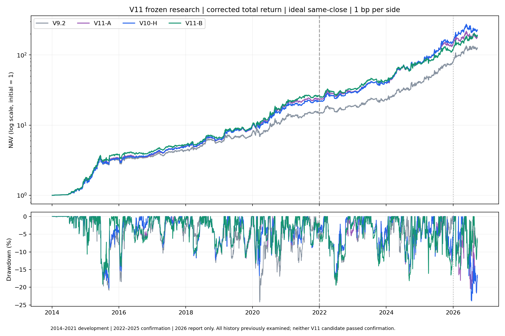

# V11 冻结研究结果

**产出了可复现的 V11-A / V11-B 研究版本，但两者均未通过预先登记的后期确认门槛，暂不替换 V10-H。** B 的全期回撤更小，值得保留观察；这不等于已证明过拟合更低。参数与结果保持冻结，没有在确认失败后改推后期赢家。

## 口径与总成绩

2014-01-02—2026-09-24，修正总回报、理想同收盘成交、单边1 bp、244观察日年化，首个总评价日免费建仓。不加杠杆、原11只ETF池、单只持仓。这里沿用 V10-H 年化53.31%的已修正口径，不混用旧加法前复权的V9.2“50%+”。所有年份此前都被研究过，分段确认和历史重选也不是全新的样本外。

H本身也经过既往全历史搜索，并不是事前独立的基准。V11未过相对H的门槛，不能反过来证明H未来一定优于V11，或H已没有过拟合。这里能确定的是：本轮尚未拿到足以支持“高收益且更低过拟合升级”的证据。

| 版本 | 总收益 | 年化 | 最大回撤 | 实际换仓次数 |
| --- | --- | --- | --- | --- |
| V9 | 9468.84% | 43.24% | -24.16% | 254 |
| V9.1 | 9960.00% | 43.81% | -24.16% | 249 |
| V9.2 | 12432.65% | 46.32% | -24.16% | 272 |
| V10-H | 22566.90% | 53.31% | -23.88% | 315 |
| V11-A | 17964.91% | 50.59% | -21.62% | 332 |
| V11-B | 18902.99% | 51.20% | -19.47% | 323 |



## 两个候选具体改了什么

- A：保留 H 的20日WLS评分及3日平滑，将三类动量缓冲统一为1%，普通健康轮动最短持有3个后续观察日。
- B：在同样1%缓冲和3日健康持有基础上，将评分换成10/20/40日WLS风险调整斜率的固定等权均值，不再额外平滑。仍是单只ETF持仓，不是三条资金曲线免费组合。
- 两者保留H的MA180体制、波动退出、原抄底通道与5日锁仓等规则。健康最短持有仅延后普通轮动，不能解释成抄底锁仓期间可无条件风险退出。1%缓冲更敏感，抵消了最短持有的降频作用，实际换仓次数并未下降。

## 冻结后的确认

| 阶段 | V10-H | V11-A | V11-B |
| --- | --- | --- | --- |
| 开发 2014–2021 | 47.28% | 48.57% | 50.38% |
| 确认 2022–2025 | 63.58% | 56.86% | 46.72% |
| 2026至09-24累计 | 45.47% | 27.72% | 59.06% |

前两行是区间年化，2026是截至09-24的累计收益。2026在候选冻结及确认结束后才生成，不参与救回失败模型。

| 2022–2025 情景：年化 / 最大回撤 | V10-H | V11-A | V11-B |
| --- | --- | --- | --- |
| close_1bp | 63.58% / -17.00% | 56.86% / -17.00% | 46.72% / -19.47% |
| close_11bp | 55.38% / -18.16% | 48.40% / -18.16% | 38.39% / -20.91% |
| lag1_1bp | 51.43% / -18.51% | 44.03% / -18.51% | 32.07% / -22.69% |
| lag1_11bp | 43.84% / -19.13% | 36.26% / -19.13% | 24.56% / -23.62% |

A通过三项回撤要求，但收益门槛和两项成本/延迟收益要求失败；B六项要求均失败。门槛在跑后期前已写好：主年化至少30%且不低于同段H的90%，主回撤不恶化超过2个百分点，高费用及高费用+延迟的年化不少于H、回撤不恶化超过2个百分点。开发期更强，并没有确保后期持续领先。

## 逐年收益

| 年份 | V9 | V9.1 | V9.2 | V10-H | V11-A | V11-B |
| --- | --- | --- | --- | --- | --- | --- |
| 2014 | 65.58% | 65.58% | 65.58% | 62.45% | 67.02% | 74.89% |
| 2015 | 90.95% | 90.55% | 90.55% | 102.58% | 102.58% | 115.12% |
| 2016 | 34.62% | 30.33% | 13.21% | 17.33% | 11.54% | 11.11% |
| 2017 | 11.22% | 10.09% | 20.15% | 25.49% | 30.60% | 23.66% |
| 2018 | 17.57% | 17.57% | 35.83% | 31.19% | 27.72% | 29.13% |
| 2019 | 33.34% | 34.22% | 34.22% | 54.36% | 53.78% | 50.95% |
| 2020 | 63.95% | 63.95% | 63.95% | 85.20% | 103.64% | 101.76% |
| 2021 | 16.15% | 17.00% | 17.00% | 21.46% | 20.06% | 28.22% |
| 2022 | 13.32% | 13.32% | 23.93% | 32.91% | 26.15% | 24.58% |
| 2023 | 25.93% | 25.93% | 25.62% | 38.47% | 36.28% | 33.94% |
| 2024 | 71.66% | 74.43% | 74.43% | 93.08% | 90.11% | 75.22% |
| 2025 | 95.08% | 95.65% | 95.41% | 98.66% | 82.87% | 56.76% |
| 2026 | 41.69% | 50.74% | 57.36% | 45.47% | 27.72% | 59.06% |

均为该年累计收益。2026不是完整年度；各年包含年界首个交易日的旧持仓涨跌和真实换仓费用，没有年度免费重启。

## 执行压力：全期年化 / 最大回撤

| 时钟与成本 | V10-H | V11-A | V11-B |
| --- | --- | --- | --- |
| 同收盘 / 单边1 bp | 53.31% / -23.88% | 50.59% / -21.62% | 51.20% / -19.47% |
| 同收盘 / 单边5 bp | 50.29% / -24.55% | 47.47% / -22.81% | 48.15% / -20.05% |
| 同收盘 / 单边11 bp | 45.88% / -25.54% | 42.91% / -24.55% | 43.68% / -20.91% |
| 同收盘 / 单边21 bp | 38.79% / -27.17% | 35.60% / -27.37% | 36.53% / -22.32% |
| 延迟1日 / 单边1 bp | 38.18% / -35.13% | 37.48% / -37.22% | 37.80% / -26.84% |
| 延迟1日 / 单边5 bp | 35.44% / -36.00% | 34.62% / -38.71% | 35.00% / -27.71% |
| 延迟1日 / 单边11 bp | 31.44% / -37.30% | 30.43% / -40.88% | 30.91% / -29.00% |
| 延迟1日 / 单边21 bp | 25.02% / -40.41% | 23.72% / -44.33% | 24.35% / -31.11% |

1 bp=0.01%，完整换仓计两边。延迟1日表示前一收盘信号在下一收盘成交，并非下一开盘，也不是把收益数组简单后移。B全期压力回撤改善，但未在后期确认继续取得收益优势。真实14:50报价、现金分红到账日、交易单位与跨境ETF溢价成交仍未建模；几十万元资金不会自动消除信号时点偏差。

主口径H全期最大回撤落在2026-07-24，B的最大回撤落在2022-07-01。确认段B的回撤其实比H更深（19.47%对17.00%）；因此全期回撤改善也不能单独代替跨阶段稳健性证据。

## 搜索与过拟合诊断

A登记593个原始提案、去重586个配置；其中17个已有历史研究签名。B是看到A开发结果后明确登记的一次有限自适应组合扩展，不能冒充最初即登记；A∪B共有714个配置。另有邻域、消融、8个长期趋势控制及每折重选试验，714不是全部尝试数。V10此前还试过9558个唯一单持仓配置，不能忽略这段研究历史。

OLS-log、Huber、Theil–Sen、加权log趋势，多期限均分数/均排名，事前波动尺度，固定退出，去牛熊划分，关抄底，现金回退，持有/确认规则都已纳入登记枚举。原池固定用于主选型，删票只用于稳定性诊断，没有据此再挑赢家池。论文方向及具体实现差异见 [LITERATURE.md](LITERATURE.md)。

714全族同步时间区块White-style检验，2000次重采样，相对同情景H；下面是两种平均区块长度的p值。它是条件于本族的未学生化检验，不能解释为过拟合概率，也没有校正整个旧项目或B组件生成的适应性。

| 情景 | 20日区块 p | 60日区块 p |
| --- | --- | --- |
| close_1bp | 0.9960 | 0.9965 |
| close_11bp | 0.9985 | 0.9985 |
| lag1_1bp | 0.8941 | 0.8686 |
| lag1_11bp | 0.8511 | 0.8341 |

没有显著的全族优势证据。开发期同收盘1bp情景中，B最大的10个正优势日贡献了正log超额的33.98%、净log超额的228.03%；去掉这10天的固定路径算术诊断会转为负超额。超过100%来自其它日期抵消，这不是“总利润有228%来自10天”，也不是可执行的删日策略。

邻域全部来自开发期。既报告全部有效扰动，也报告A/B/H共同的8个扰动，不能只展示有利方向。最后两列是邻居相对自身中心的最差压力子段年化差的下四分位。

| 中心 | 完整邻域过H门槛 | 共同8扰动过H门槛 | 完整自身差Q25 | 共同自身差Q25 |
| --- | --- | --- | --- | --- |
| H | 1/9 | 1/8 | -5.50 pp | -5.56 pp |
| A | 3/11 | 2/8 | -5.48 pp | -5.36 pp |
| B | 10/16 | 4/8 | -6.82 pp | -7.32 pp |

B更多邻居仍过H门槛，但相对自身中心的下降反而更大，不能据此说B位于更平坦的参数区域。长期趋势8个简化控制在开发期年化约3.38%—12.66%，不满足本轮收益目标；这仅反映本ETF池、长仓、固定槽位和调仓方式，不否定原文的多空期货策略。

## 历史重选：连续账户2018–2025

| 执行情景：年化 / 最大回撤 | 固定H | A选择过程 | B选择过程 |
| --- | --- | --- | --- |
| close_1bp | 54.66% / -17.00% | 51.37% / -17.00% | 43.71% / -19.47% |
| close_11bp | 46.59% / -18.16% | 43.29% / -18.16% | 36.01% / -20.91% |
| lag1_1bp | 43.32% / -29.31% | 41.45% / -28.29% | 31.44% / -28.29% |
| lag1_11bp | 35.81% / -30.85% | 33.86% / -30.10% | 24.36% / -29.57% |

| 各执行段同收盘1bp年化 | 固定H | A选择过程 | B选择过程 |
| --- | --- | --- | --- |
| 2018–2019 | 42.41% | 39.26% | 34.58% |
| 2020–2021 | 50.23% | 44.75% | 48.35% |
| 2022–2023 | 36.01% | 31.41% | 28.52% |
| 2024–2025 | 96.67% | 98.21% | 66.25% |

四种压力下，A/B整个重选过程年化均落后固定H。按同收盘1bp的四个两年执行段，A赢1/4、B赢0/4；B开发阶段的局部组合优势未能在重选过程复现。2021截止的重选准确恢复原先冻结的A/B候选，排除了使用不同选择器造成的错配。

训练终点2017/2019/2021/2023，每次执行随后两年；B在每折根据当时A训练结果重新生成组件，没有回填2021选出的组件。所有账户从2014共同H初始化、2018开始实际切模型，持仓、估值价、年龄和锁仓连续保留，只在真实换仓时收费。完整分折选择、边界和交易见 [reselection/evaluation.json](results/reselection/evaluation.json)。这诊断选择过程的可重复性，不是承诺今后动态调参。

## 删票与正确性

逐一取消7只股票ETF和2只跨境ETF的交易资格；A/B/H相同剔除、保留黄金及货币ETF，并继续保留原基准指标。不是删除该资产所有信息通道。所有结果及相对自身完整池、配对H的差异见 [留一法完整记录](results/leave_one_out/evaluation.json)。这些结果未用于更换候选池或参数。

| 删除交易资格：全期同收盘1bp年化 | V10-H | V11-A | V11-B |
| --- | --- | --- | --- |
| 完整池 | 53.31% | 50.59% | 51.20% |
| 159915 | 45.11% | 38.75% | 37.74% |
| 510300 | 47.93% | 47.22% | 47.16% |
| 510500 | 52.13% | 50.53% | 47.25% |
| 512400 | 49.44% | 49.61% | 48.59% |
| 512890 | 48.09% | 45.23% | 47.00% |
| 563300 | 51.81% | 51.59% | 52.34% |
| 588080 | 52.37% | 49.80% | 48.98% |
| 513100 | 37.35% | 35.09% | 38.24% |
| 513120 | 45.99% | 45.07% | 45.64% |

删除纳指ETF 513100 后三者收益均明显下降，显示共同资产依赖，不只发生在新候选。确认2022–2025，B在全部9种删票、四种情景下仍落后配对H；A仅同收盘1bp删513120时微弱领先0.015个百分点，其余均落后。删票结果没有救回确认失败。

独立P&L重计、原版本复现、原生实现与Python参考逐日对账及抄底真实事件簇见 [最终审计](results/final_audit/REPORT.md)。区间切片包含首日收益、分红口径沿用修正TR。原V9/V10策略与生产推送、账户均未接入V11。

11个最终配置×8情景共88条路径独立重计，逐日收益误差为0；5984个逐年/分段指标在浮点容差内一致。A/B/H/simple各3097日的参考实现完全一致。原H、A、B都有27个真实抄底成交触发，合并为19个事件簇；其中周边观察窗口有重叠，不视为独立样本。确认期的落后主要来自持仓市场收益差，而不是费用漏算或多算。

## 复现与使用

新克隆先恢复被归档的原始矩阵：

```bash
python3.8 -B -m v11.artifacts restore
python3.8 -B -m v11.cli backtest b
python3.8 -B -m v11.cli backtest b --lag 1 --fee-bp 11
python3.8 -B -m v11.cli signal b --end 2026-09-24
```

`a/b/h`分别为冻结A、B、H对照。signal只给冻结历史日的模型目标，不发推送、不下单、不使用当前实时行情。profiles包含代码、依赖、输入及证据hash；已有结果拒绝覆盖。CSV里的收益/回撤为小数，显示表格才转换为百分比。

主要产物：[全期CSV](results/full_comparison.csv)、[逐年CSV](results/annual_returns.csv)、[费用/延迟CSV](results/execution_stress.csv)、[冻结候选](profiles.json)、[事前协议](PROTOCOL.md)、[组合扩展协议](COMBINATION_PROTOCOL.md)。
