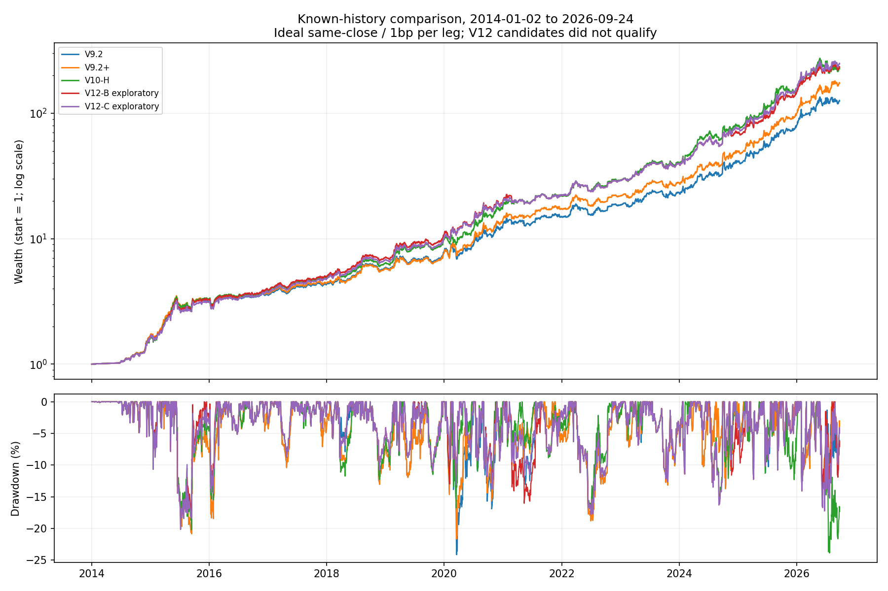

# V12 冻结数值附表

数据为2014-01-02—2026-09-24，共3097个交易日。主口径：修正总回报、理想同收盘、单边1bp、首日免费、244日年化。所有 V12 行均为未通过全部资格的探索对照。

## 全期对比

| 策略 | 全期累计收益 | 全期年化 | 最大回撤 | 2026累计收益 |
| --- | --- | --- | --- | --- |
| V9 | 9468.84% | 43.24% | -24.16% | 41.69% |
| V9.1 | 9960.00% | 43.81% | -24.16% | 50.74% |
| V9.2 | 12432.65% | 46.32% | -24.16% | 57.36% |
| V9.2+ | 17275.44% | 50.13% | -21.68% | 75.27% |
| V10-H | 22566.90% | 53.31% | -23.88% | 45.47% |
| V12-A 探索 | 24930.66% | 54.51% | -20.61% | 52.41% |
| V12-B 探索 | 23189.15% | 53.64% | -20.16% | 59.03% |
| V12-C 探索 | 24675.18% | 54.39% | -20.16% | 57.13% |

## 每年累计收益

完整年份列示当年实际复利收益；2026*只到9月24日，不能当全年收益或保证。若需要244日折算年化，见 yearly_metrics.csv；年度收益取连续账户切片，不逐年重启账户。

| 年份 | V9 | V9.1 | V9.2 | V9.2+ | V10-H | V12-A 探索 | V12-B 探索 | V12-C 探索 |
| --- | --- | --- | --- | --- | --- | --- | --- | --- |
| 2014 | 65.58% | 65.58% | 65.58% | 69.49% | 62.45% | 66.14% | 65.44% | 65.44% |
| 2015 | 90.95% | 90.55% | 90.55% | 90.55% | 102.58% | 102.58% | 96.23% | 87.54% |
| 2016 | 34.62% | 30.33% | 13.21% | 13.21% | 17.33% | 17.33% | 20.53% | 20.53% |
| 2017 | 11.22% | 10.09% | 20.15% | 20.15% | 25.49% | 25.49% | 26.17% | 26.17% |
| 2018 | 17.57% | 17.57% | 35.83% | 30.66% | 31.19% | 31.19% | 42.74% | 42.74% |
| 2019 | 33.34% | 34.22% | 34.22% | 33.30% | 54.36% | 55.35% | 52.12% | 50.06% |
| 2020 | 63.95% | 63.95% | 63.95% | 84.76% | 85.20% | 96.52% | 85.39% | 92.53% |
| 2021 | 16.15% | 17.00% | 17.00% | 22.75% | 21.46% | 15.09% | 12.60% | 15.12% |
| 2022 | 13.32% | 13.32% | 23.93% | 26.58% | 32.91% | 32.91% | 30.09% | 30.09% |
| 2023 | 25.93% | 25.93% | 25.62% | 27.52% | 38.47% | 36.58% | 36.29% | 36.29% |
| 2024 | 71.66% | 74.43% | 74.43% | 74.70% | 93.08% | 97.57% | 74.26% | 87.52% |
| 2025 | 95.08% | 95.65% | 95.41% | 102.63% | 98.66% | 100.48% | 111.82% | 111.71% |
| 2026* | 41.69% | 50.74% | 57.36% | 75.27% | 45.47% | 52.41% | 59.03% | 57.13% |

## 费用与一个收盘延迟

单元格为全期年化 / 最大回撤。close是理想同收盘，lag1是延迟一个收盘，不是下一开盘或14:50。bp为单边；非初始全换仓扣两边费用。

| 情景 | V10-H | V12-A 探索 | V12-B 探索 | V12-C 探索 |
| --- | --- | --- | --- | --- |
| close_1bp | 53.31% / -23.88% | 54.51% / -20.61% | 53.64% / -20.16% | 54.39% / -20.16% |
| close_5bp | 50.29% / -24.55% | 51.52% / -21.24% | 50.52% / -20.55% | 51.22% / -20.55% |
| close_11bp | 45.88% / -25.54% | 47.14% / -22.28% | 45.96% / -21.12% | 46.58% / -21.12% |
| close_21bp | 38.79% / -27.17% | 40.10% / -24.29% | 38.65% / -22.06% | 39.15% / -22.87% |
| lag1_1bp | 38.18% / -35.13% | 38.62% / -31.49% | 38.81% / -28.52% | 42.06% / -26.82% |
| lag1_5bp | 35.44% / -36.00% | 35.92% / -32.85% | 35.99% / -29.43% | 39.13% / -27.99% |
| lag1_11bp | 31.44% / -37.30% | 31.96% / -34.84% | 31.87% / -30.98% | 34.83% / -29.70% |
| lag1_21bp | 25.02% / -40.41% | 25.61% / -38.03% | 25.27% / -33.56% | 27.96% / -32.46% |

## 分红现金金额敏感性

表内为同收盘1bp的全期年化。lower/upper是已识别分红事件的现金金额区间，不是策略收益上下界；official_515100替换一笔已核官方金额，但该票不在这些固定原池内。完整四情景和2026结果见 cash_precision.csv。

| 分红情景 | V10-H | V12-A 探索 | V12-B 探索 | V12-C 探索 |
| --- | --- | --- | --- | --- |
| base | 53.31% | 54.51% | 53.64% | 54.39% |
| cash_lower | 53.94% | 55.15% | 54.27% | 55.02% |
| cash_upper | 53.31% | 54.52% | 53.59% | 54.34% |
| official_515100 | 53.31% | 54.51% | 53.64% | 54.39% |

## 全候选族检验

完整 A∪B∪C 的1807项，配对平稳区块重采样；每个情景/区块长度2000次同步重采样、固定seed20260928。p值不是过拟合概率，也没有覆盖本项目前期全部搜索和自适应造候选过程。

| 情景 | p：20日块 | p：60日块 |
| --- | --- | --- |
| close_1bp | 0.997001 | 0.997501 |
| close_11bp | 0.997001 | 0.998501 |
| lag1_1bp | 0.914043 | 0.888056 |
| lag1_11bp | 0.943028 | 0.922539 |

## 每轮公开的极值对照

只用于展示取舍，不是晋级策略，也没有被拿来替换失败主选择。相同ID跨阶段只计一个配置。

| 阶段 | 角色 | 配置ID | 年化 | 最大回撤 | 2026累计 |
| --- | --- | --- | --- | --- | --- |
| main | top_return | v12_d961c9516f25610bda74 | 55.14% | -27.28% | 44.27% |
| main | top_tail | v12_47b31cea55c688ab7a2a | 49.95% | -23.99% | 91.19% |
| main | least_drawdown | v12_cc15a17e97552cd4b2ad | 36.52% | -13.10% | 21.05% |
| consensus | top_return | v12_bb36c1de9e534b1cf332 | 53.64% | -20.16% | 59.03% |
| consensus | top_tail | v12_9804bce55872af4a0911 | 49.77% | -30.24% | 83.63% |
| consensus | least_drawdown | v12_deb9322de9028f6b5dc6 | 48.11% | -19.74% | 48.40% |
| exante | top_return | v12_d961c9516f25610bda74 | 55.14% | -27.28% | 44.27% |
| exante | top_tail | v12_feba79332501f5176f95 | 49.63% | -25.86% | 107.36% |
| exante | least_drawdown | v12_05905d5b3f1356b766b2 | 53.46% | -19.37% | 47.84% |

