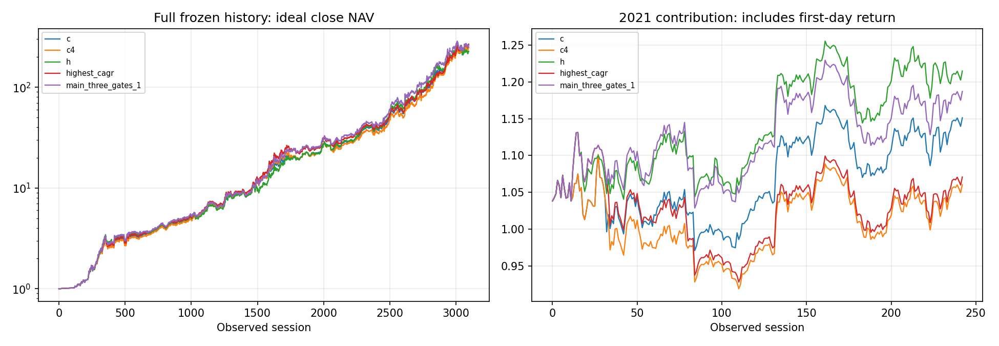

# R2逐年和局部表

全部是已知历史结果，不是新的实盘策略。严格和折衷资格均为0。
“三主指标达标”仅指全期年化不低C4、回撤≤21%、2021至少恢复C；该唯一配置的2026及延迟压力仍失败，不是另设的晋级层或推荐。

| 年份 | C对照 | C4 | H | 最高2021（未合格） | 最高年化（未合格） | 三主指标达标（压力失败） | V9.2+ |
|---|---:|---:|---:|---:|---:|---:|---:|
| 2014 | 65.443% | 65.443% | 62.449% | 62.266% | 65.443% | 65.642% | 69.486% |
| 2015 | 87.545% | 81.771% | 102.577% | 110.671% | 93.501% | 104.057% | 90.545% |
| 2016 | 20.528% | 23.119% | 17.330% | 16.999% | 23.119% | 16.999% | 13.214% |
| 2017 | 26.168% | 24.745% | 25.486% | 28.562% | 24.745% | 28.562% | 20.148% |
| 2018 | 42.740% | 43.306% | 31.189% | 31.691% | 42.601% | 31.691% | 30.657% |
| 2019 | 50.055% | 52.356% | 54.357% | 58.945% | 52.356% | 51.841% | 33.297% |
| 2020 | 92.532% | 106.574% | 85.200% | 62.775% | 119.299% | 113.034% | 84.757% |
| 2021 | 15.123% | 6.042% | 21.464% | 22.597% | 7.084% | 18.698% | 22.751% |
| 2022 | 30.092% | 26.453% | 32.915% | 28.061% | 26.453% | 30.796% | 26.579% |
| 2023 | 36.291% | 31.829% | 38.475% | 31.783% | 31.829% | 31.840% | 27.515% |
| 2024 | 87.523% | 79.966% | 93.084% | 87.814% | 79.966% | 100.823% | 74.696% |
| 2025 | 111.707% | 117.140% | 98.657% | 87.462% | 102.304% | 100.037% | 102.631% |
| 2026 | 57.130% | 74.913% | 45.471% | 37.033% | 74.913% | 46.818% | 75.268% |

2026截至09-24，非全年。所有年份包含年界首日的真实旧持仓收益，没有免费年度重启。

## 局部敏感性（全部点已在主网格，无新增回测）

| 解释项ID | 邻居数 | 邻居自身年化差中位数 / Q25(pp) |
|---|---:|---:|
| v12r2_08b522c2e1aa291f054d | 12 | -1.794 / -2.700 |
| v12r2_7743224871bb70b78781 | 9 | 1.826 / -0.799 |
| v12r2_9a8799a5f7dd7581608e | 10 | -1.922 / -2.831 |

[四压力年表CSV](results/yearly.csv) · [所有单轴变化CSV](results/local_sensitivity.csv)

解释项可只读查询：`python3.8 -B -m v12_r2.inspect highest_cagr` 或 `main_three_gates_1`。输出会保留未过门槛，不冒名为主候选。
